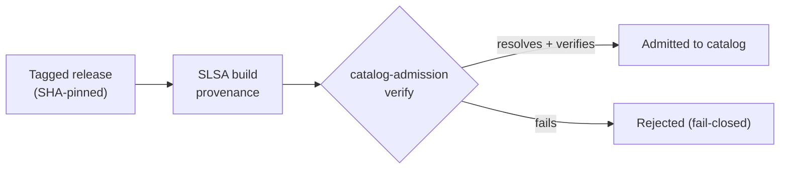

## How admission works

A plugin is listed only after its pinned release resolves to a real plugin and
its SLSA attestation verifies fail-closed — no attestation, no listing.

Each catalog entry pins a plugin to a `ref` + full-length commit `sha`; the
`catalog-admission` workflow re-resolves the pin and verifies the release
attestation before the plugin appears. Read
[how to add a plugin](how-to/add-a-plugin/) to submit one, or
[verify a release](security/verify/) to check an artifact yourself.
